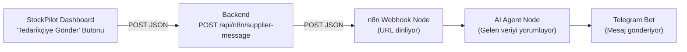

# 🔗 n8n Bağlantı Rehberi — StockPilot AI → n8n → AI Agent → Telegram

> [!NOTE]
> Bu rehber, **hiç n8n kullanmamış** biri için sıfırdan yazılmıştır.
> Her adım ekran ekran, tık tık anlatılmaktadır.

---

## 📋 Genel Bakış — Ne Yapacağız?

Projemizde şu akış var:



**Mevcut durum:** Dashboard'daki "Tedarikçiye Gönder" butonu çalışıyor, backend n8n webhook URL'sine veri gönderiyor. Ama n8n tarafı henüz kurulmadı.

**Bu rehberde yapacaklarımız:**
1. Telegram Bot oluşturacağız (BotFather ile)
2. n8n Cloud hesabı açacağız (ücretsiz)
3. n8n'de bir Workflow oluşturacağız:
   - **Webhook Node** → Veriyi alır
   - **AI Agent Node** → Veriyi yorumlar (Gemini veya OpenAI ile)
   - **Telegram Node** → Yorumlanmış mesajı Telegram'a gönderir
4. Backend'deki webhook URL'yi güncelleyeceğiz

---

## 🤖 ADIM 1: Telegram Bot Oluşturma

Bu adımda Telegram'da bir bot oluşturacağız. Bu bot, n8n'den gelen mesajları sana Telegram'da gönderecek.

### 1.1 — Telegram'ı Aç

- Telefonunda veya bilgisayarında **Telegram** uygulamasını aç.
- Eğer Telegram'ın yoksa: [https://telegram.org](https://telegram.org) adresinden indir.

### 1.2 — BotFather'ı Bul

1. Telegram'ın arama çubuğuna **`@BotFather`** yaz.
2. **BotFather** adlı, mavi tik işaretli resmi hesabı seç.
3. "Start" veya "Başlat" butonuna bas.

### 1.3 — Yeni Bot Oluştur

1. BotFather'a şu mesajı yaz:
   ```
   /newbot
   ```
2. BotFather sana soracak: **"Botunuz için bir isim verin"**
   - Yaz: `StockPilot Sipariş Botu` (istediğin ismi verebilirsin)
3. Sonra soracak: **"Botunuz için bir kullanıcı adı verin (bot ile bitmeli)"**
   - Yaz: `stockpilot_order_bot` (benzersiz olmalı, `_bot` ile bitsin)

> [!IMPORTANT]
> Bot kullanıcı adı benzersiz olmalıdır. Eğer "already taken" hatası alırsan, farklı bir ad dene.
> Örneğin: `stockpilot_siparis_bot`, `sp_tedarik_bot` vb.

### 1.4 — Bot Token'ını Kaydet

BotFather sana şöyle bir mesaj gönderecek:

```
Done! Congratulations on your new bot.
...
Use this token to access the HTTP API:
7123456789:AAHxxxxxxxxxxxxxxxxxxxxxxxxxxxxxxx
```

> [!CAUTION]
> **Bu token'ı bir yere kaydet!** Daha sonra n8n'de kullanacağız.
> Bu token'ı kimseyle paylaşma — botu kontrol eden şifredir.

### 1.5 — Chat ID'ni Öğren

n8n'in sana mesaj gönderebilmesi için **Chat ID**'ne ihtiyacı var.

1. Telegram'da az önce oluşturduğun botu bul (arama çubuğuna `@stockpilot_order_bot` yaz)
2. Botu aç ve **"Start" / "Başlat"** butonuna bas (bu zorunlu! basmadan devam etme)
3. Bota herhangi bir mesaj yaz. Örneğin: `merhaba`
4. Şimdi tarayıcında şu URL'yi aç (kendi token'ını yaz):
   ```
   https://api.telegram.org/bot<SENIN_TOKEN>/getUpdates
   ```
   Örnek:
   ```
   https://api.telegram.org/botBOT_TOKENIN_BURAYA/getUpdates
   ```
5. Açılan JSON sayfasında şunu ara:
   ```json
   "chat": {
     "id": 123456789,
     ...
   }
   ```
6. **Bu `id` numarasını kaydet!** Bu senin Chat ID'n.

> [!TIP]
> Alternatif olarak, Telegram'da `@userinfobot`'a `/start` yazarak da Chat ID'ni öğrenebilirsin.

---

## ☁️ ADIM 2: n8n Cloud Hesabı Açma

### 2.1 — n8n Cloud'a Git

1. Tarayıcında şu adrese git: [https://app.n8n.cloud/register](https://app.n8n.cloud/register)
2. **"Start free"** veya **"Get Started Free"** butonuna tıkla.

### 2.2 — Hesap Oluştur

1. E-posta adresini gir
2. Şifre belirle
3. **"Create account"** butonuna tıkla
4. E-postana gelen doğrulama linkine tıkla

### 2.3 — İlk Girişi Yap

- Giriş yaptıktan sonra n8n'in ana ekranını göreceksin.
- Sol tarafta menü var, sağ tarafta boş bir alan.

> [!NOTE]
> n8n Cloud'un ücretsiz planı aylık **belirli sayıda** çalıştırma hakkı verir (genellikle test ve hackathon için fazlasıyla yeterli).

---

## 🔧 ADIM 3: n8n'de Workflow Oluşturma

### 3.1 — Yeni Workflow Aç

1. n8n ana ekranında sağ üstteki **"+ Add Workflow"** butonuna tıkla.
2. Workflow adı olarak yaz: **`StockPilot Supplier Notification`**
3. Enter'a bas veya herhangi bir yere tıkla.

Şimdi boş bir tuval (canvas) göreceksin. Bu tuvale **node** (düğüm) ekleyeceğiz.

---

### 3.2 — Webhook Node Ekle (Veri Alma Noktası)

Bu node, StockPilot backend'inden gelen POST isteklerini dinleyecek.

1. Tuvaldeki **"+"** butonuna tıkla (veya boş alana çift tıkla).
2. Arama çubuğuna **`Webhook`** yaz.
3. **"Webhook"** node'unu seç.

#### Webhook Ayarları:

| Ayar | Değer |
|------|-------|
| **HTTP Method** | `POST` |
| **Path** | `stockpilot-supplier` |
| **Authentication** | `None` (hackathon için yeterli) |
| **Respond** | `Immediately` |

4. Bu ayarları yaptıktan sonra node'un üstünde iki URL göreceksin:
   - **Test URL**: `https://SENIN-INSTANCE.app.n8n.cloud/webhook-test/stockpilot-supplier`
   - **Production URL**: `https://SENIN-INSTANCE.app.n8n.cloud/webhook/stockpilot-supplier`

> [!IMPORTANT]
> **Test URL** sadece workflow editördeyken ve "Listen for test event" aktifken çalışır.
> **Production URL** workflow **aktif** (Active) yapıldıktan sonra çalışır.
> Geliştirme sırasında Test URL, demo sırasında Production URL kullan.

5. **Production URL'yi bir yere kopyala!** Bunu backend'e yazacağız.

---

### 3.3 — AI Agent Node Ekle (Veriyi Yorumlama)

Bu node, gelen tedarikçi sipariş verisini bir AI modeline gönderip anlamlı bir mesaj oluşturacak.

1. Webhook node'unun sağ tarafındaki **"+"** butonuna tıkla.
2. Arama çubuğuna **`AI Agent`** yaz.
3. **"AI Agent"** node'unu seç.

#### AI Agent Ayarları:

**a) Agent Tipini Seç:**
- **Agent**: `Tools Agent` (varsayılan, bu uygun)

**b) Prompt (System Message) Yaz:**

"System Message" veya "Instructions" alanına şunu yapıştır:

```
Sen bir restoran tedarik asistanısın. Sana gelen JSON verisinde bir restoranın bugünkü sipariş listesi var.

Bu veriyi analiz et ve şu formatta Türkçe bir mesaj oluştur:

📦 [İşletme Adı] - Günlük Sipariş Özeti
📅 Tarih: [tarih]

Sipariş Listesi:
- [Miktar] [Birim] [Malzeme Adı]
- [Miktar] [Birim] [Malzeme Adı]
...

💡 Toplam [kaç] kalem ürün sipariş edilecek.

⚠️ Eğer bir malzeme acil gibi görünüyorsa (miktarı yüksekse) bunu belirt.

Mesajı kısa, öz ve profesyonel yaz.
```

**c) AI Model Bağlantısı (Credentials):**

AI Agent node'unun altında **"Chat Model"** bağlantı noktası var. Buraya bir model bağlaman gerekiyor:

##### Seçenek A: Google Gemini (Ücretsiz API Key ile) — ÖNERİLEN
1. AI Agent node'undaki "Chat Model" altındaki **"+"** butonuna tıkla.
2. **"Google Gemini Chat Model"** seç.
3. Model ayarları:
   - **Model**: `gemini-2.0-flash` veya `gemini-1.5-flash`
4. **Credentials**: "Create New Credential" tıkla:
   - [https://aistudio.google.com/apikey](https://aistudio.google.com/apikey) adresine git.
   - **"Create API Key"** tıkla (Google hesabınla giriş yapman gerekebilir).
   - API Key'i kopyala.
   - n8n'e geri dön ve **API Key** alanına yapıştır.
   - **"Save"** tıkla.

##### Seçenek B: OpenAI (Ücretli, kredi gerekiyor)
1. AI Agent node'undaki "Chat Model" altındaki **"+"** butonuna tıkla.
2. **"OpenAI Chat Model"** seç.
3. Model: `gpt-4o-mini` (en ucuzu)
4. Credentials: [https://platform.openai.com/api-keys](https://platform.openai.com/api-keys) adresinden API Key al.

> [!TIP]
> **Gemini Flash** ücretsizdir ve hackathon için mükemmel çalışır. İlk önce bunu dene.

**d) Input Olarak Webhook Verisini Bağla:**

AI Agent node'unun "Prompt" (veya "Text") alanına şunu yaz:

```
{{ JSON.stringify($json) }}
```

Bu ifade, Webhook'tan gelen tüm JSON verisini AI Agent'a metin olarak gönderir.

> [!NOTE]
> n8n'de `{{ }}` içindeki ifadeler "expression" olarak çalışır. `$json` o anki node'a gelen veriyi temsil eder.

---

### 3.4 — Telegram Node Ekle (Mesaj Gönderme)

1. AI Agent node'unun sağ tarafındaki **"+"** butonuna tıkla.
2. Arama çubuğuna **`Telegram`** yaz.
3. **"Telegram"** node'unu seç.

#### Telegram Ayarları:

| Ayar | Değer |
|------|-------|
| **Resource** | `Message` |
| **Operation** | `Send Message` |
| **Chat ID** | ADIM 1.5'te kaydettiğin Chat ID (örn: `123456789`) |

**Credentials (Bot Token Bağlama):**

1. **"Credential to connect with"** yanındaki açılır menüden **"Create New Credential"** seç.
2. Açılan pencerede:
   - **Access Token**: ADIM 1.4'te kaydettiğin Bot Token'ı yapıştır
     (Örn: `7123456789:AAHxxxxxxxxxxxxxxxxxxxxxxxxxxxxxxx`)
3. **"Save"** tıkla.

**Mesaj İçeriği:**

"Text" alanına şunu yaz:

```
{{ $json.output }}
```

Bu, AI Agent'ın ürettiği yorumlanmış mesajı Telegram'a gönderir.

> [!NOTE]
> AI Agent node'u çıktıyı genellikle `output` alanında döndürür.
> Eğer çalışmazsa, test sonrası çıktıya bakıp doğru alan adını (`text`, `response` vb.) yazabilirsin.

#### Parse Mode (Opsiyonel ama Önerilen):

- **Parse Mode**: `Markdown` seç
  - Bu sayede AI'ın ürettiği mesajdaki kalın yazılar, listeler vs. Telegram'da düzgün görünür.

---

### 3.5 — Node'ları Birbirine Bağla

Eğer yukarıdaki adımları sırayla yaptıysan, node'lar zaten bağlı olmalı. Değilse:

1. **Webhook** node'unun sağ çıkış noktasını tut → **AI Agent** node'unun sol giriş noktasına sürükle.
2. **AI Agent** node'unun sağ çıkış noktasını tut → **Telegram** node'unun sol giriş noktasına sürükle.

Sonuç olarak şunu görmelisin:

```
[Webhook] → [AI Agent] → [Telegram]
```

---

## 🧪 ADIM 4: Testi Yapma

### 4.1 — n8n Tarafında Test Modunu Aç

1. **Webhook** node'una çift tıkla.
2. **"Listen for test event"** butonuna tıkla (veya "Test" sekmesindeki butona bas).
3. n8n artık **Test URL**'den gelen istekleri dinlemeye başladı.
4. URL'yi kopyala (test URL'yi).

### 4.2 — Backend'deki URL'yi Güncelle

Projedeki `backend/src/routes/n8n.route.ts` dosyasında bu satırı bul:

```typescript
const N8N_WEBHOOK_URL = process.env.N8N_WEBHOOK_URL || 'https://le7ox3ro.rcld.app/webhook-test/react-telegram-trigger';
```

Bu URL'yi **kendi n8n Test URL'nle** değiştir:

```typescript
const N8N_WEBHOOK_URL = process.env.N8N_WEBHOOK_URL || 'https://SENIN-INSTANCE.app.n8n.cloud/webhook-test/stockpilot-supplier';
```

Veya daha iyi yöntem — `.env` dosyasına ekle:

```env
N8N_WEBHOOK_URL=https://SENIN-INSTANCE.app.n8n.cloud/webhook-test/stockpilot-supplier
```

### 4.3 — Curl ile Manuel Test (Opsiyonel)

Eğer backend'i çalıştırmadan direkt test etmek istersen, terminalde şunu çalıştır:

```powershell
curl -X POST "https://SENIN-INSTANCE.app.n8n.cloud/webhook-test/stockpilot-supplier" `
  -H "Content-Type: application/json" `
  -d '{\"businessName\": \"StockPilot Cafe\", \"date\": \"2026-05-06\", \"supplierMessage\": \"Bugunki siparis listemiz\", \"items\": [{\"name\": \"Kasar\", \"amount\": 5, \"unit\": \"Paket\"}, {\"name\": \"Tost Ekmegi\", \"amount\": 2, \"unit\": \"Kutu\"}]}'
```

### 4.4 — Dashboard'dan Test

1. Backend'i çalıştır: `npm run dev` (backend klasöründe)
2. Frontend'i çalıştır: `npm run dev` (frontend klasöründe)
3. Dashboard'a git → "Analiz Çalıştır" butonuna tıkla
4. Satın Alma Önerileri tablosunda **"Tedarikçiye Gönder"** butonuna tıkla
5. n8n ekranında verinin geldiğini göreceksin!
6. Telegram'da botundan mesaj alacaksın! 🎉

### 4.5 — Sonuçları Kontrol Et

n8n'de her node'un üstüne tıklayarak çıktıyı görebilirsin:
- **Webhook**: Gelen JSON datayı gösterir
- **AI Agent**: AI'ın yorumladığı mesajı gösterir
- **Telegram**: Gönderilen mesajın detaylarını gösterir

---

## 🚀 ADIM 5: Production'a Alma (Demo İçin)

Test başarılıysa, workflow'u aktif yapman gerekiyor:

### 5.1 — Workflow'u Aktif Yap

1. n8n ekranının **sağ üst köşesinde** bir toggle (açma/kapama) butonu var.
2. Bu toggle'ı **açık** (yeşil/aktif) konuma getir.
3. Artık **Production URL** çalışıyor!

### 5.2 — Backend URL'yi Production URL ile Güncelle

`.env` dosyasını güncelle:

```env
# Test URL yerine Production URL yaz:
N8N_WEBHOOK_URL=https://SENIN-INSTANCE.app.n8n.cloud/webhook/stockpilot-supplier
```

> [!WARNING]
> Dikkat: Test URL → `/webhook-test/...`, Production URL → `/webhook/...`
> "test" kelimesinin farkına dikkat et!

---

## 🛠️ Sorun Giderme (Troubleshooting)

### ❌ "n8n servisine bağlanılamadı" hatası

| Olası Sebep | Çözüm |
|-------------|-------|
| Webhook URL yanlış | `.env` dosyasındaki URL'yi kontrol et |
| n8n workflow aktif değil | n8n'de toggle'ı aç |
| Test modunda değilsin | Webhook node'unda "Listen for test event" tıkla |
| CORS hatası | Backend üzerinden gönderiyoruz, CORS sorunu olmaz |

### ❌ Telegram mesajı gelmiyor

| Olası Sebep | Çözüm |
|-------------|-------|
| Bot token yanlış | BotFather'dan tekrar kontrol et |
| Chat ID yanlış | `@userinfobot`'tan tekrar öğren |
| Botu başlatmadın | Telegram'da bota `/start` yaz |
| AI Agent hata veriyor | n8n'de AI Agent node'una tıkla, hatayı oku |

### ❌ AI Agent çalışmıyor

| Olası Sebep | Çözüm |
|-------------|-------|
| API Key geçersiz | Google AI Studio'dan yeni key al |
| Kota doldu | Farklı bir model veya hesap dene |
| Prompt boş | `{{ JSON.stringify($json) }}` yazdığından emin ol |

---

## 📁 Proje Dosya Referansları

Bu entegrasyonla ilgili projedeki dosyalar:

| Dosya | Açıklama |
|-------|----------|
| [n8n.route.ts](file:///c:/Users/Farzetki/Desktop/GitHub/UndefinedProject/backend/src/routes/n8n.route.ts) | Backend webhook route — n8n'e POST atar |
| [PurchaseRecommendations.tsx](file:///c:/Users/Farzetki/Desktop/GitHub/UndefinedProject/frontend/src/components/dashboard/PurchaseRecommendations.tsx) | Frontend "Tedarikçiye Gönder" butonu |
| [index.ts](file:///c:/Users/Farzetki/Desktop/GitHub/UndefinedProject/backend/src/index.ts) | Backend ana dosya — `/api/n8n` route mount |
| `.env` | `N8N_WEBHOOK_URL` environment variable |

---

## 🎯 Gönderilen Veri Formatı (Referans)

StockPilot'un n8n'e gönderdiği JSON yapısı:

```json
{
  "businessName": "StockPilot Cafe",
  "date": "2026-05-06",
  "supplierMessage": "size gönderdiğimiz ürünleri tedarik etmemiz lazım gerekenleri arz ederiz",
  "items": [
    { "name": "Kaşar", "amount": 5, "unit": "Paket" },
    { "name": "Tost Ekmeği", "amount": 2, "unit": "Kutu" },
    { "name": "Domates", "amount": 10, "unit": "Kg" }
  ]
}
```

---

## ✅ Özet Checklist

- [ ] Telegram BotFather'dan bot oluşturdum
- [ ] Bot Token'ımı kaydettim
- [ ] Chat ID'mi öğrendim
- [ ] n8n Cloud hesabı açtım
- [ ] Webhook node ekledim (POST, path: stockpilot-supplier)
- [ ] AI Agent node ekledim (Gemini/OpenAI bağladım)
- [ ] Telegram node ekledim (Bot Token + Chat ID girdim)
- [ ] Node'ları birbirine bağladım
- [ ] Test URL ile denedim ve çalıştı
- [ ] Workflow'u aktif yaptım
- [ ] Backend `.env` dosyasını Production URL ile güncelledim
- [ ] Dashboard'dan "Tedarikçiye Gönder" ile test ettim
- [ ] Telegram'dan mesaj aldım! 🎉
